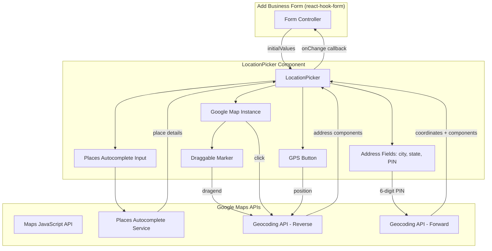

# Design Document: Business Location Picker

## Overview

The Business Location Picker is a reusable React component (`LocationPicker`) that provides an interactive Google Maps-based interface for selecting and refining a business's geographic location. It integrates with the existing multi-step Add Business form via react-hook-form, supporting multiple input methods: map click/drag, GPS detection, Google Places Autocomplete, and PIN code lookup. The component auto-populates address fields (city, state, PIN) using Google's Geocoding APIs and is designed for use in both `apps/web` and `apps/admin`.

### Key Design Decisions

1. **Single component file** at `apps/web/components/maps/LocationPicker.tsx` — re-exported for admin use rather than placed in a shared package, keeping the maps domain co-located.
2. **Controlled component pattern** — accepts initial values via props and emits changes via an `onChange` callback, making it form-library agnostic.
3. **Google Maps script loading** — reuses the existing script-loading pattern from `MapView.tsx` but adds the `places` library to the script URL.
4. **Static Indian states data** — a constant array in a dedicated file (`apps/web/components/maps/indianStates.ts`) rather than fetching from an API.
5. **Debounced geocoding** — PIN code input debounced at 500ms; reverse geocoding on pin move is immediate (user expects instant feedback after deliberate action).

## Architecture



### Data Flow

1. **Map Click / Drag / GPS** → coordinates → reverse geocode → extract address components → update form fields
2. **Places Autocomplete** → place selection → extract coordinates + address components → update map + form fields
3. **PIN Code Entry** → forward geocode (debounced 500ms) → extract coordinates + address components → update map + form fields

## Components and Interfaces

### LocationPicker Component

```typescript
// apps/web/components/maps/LocationPicker.tsx

export interface LocationData {
  lat: number;
  lng: number;
  address: string;
  city: string;
  state: string;
  pinCode: string;
}

export interface LocationPickerProps {
  /** Initial location values (for edit mode) */
  initialValues?: Partial<LocationData>;
  /** Callback fired whenever location data changes */
  onChange: (data: LocationData) => void;
  /** Optional error messages for inline validation display */
  errors?: Partial<Record<keyof LocationData, string>>;
  /** Optional CSS class for the container */
  className?: string;
}
```

### Internal State (managed via useState/useRef)

```typescript
interface LocationPickerState {
  /** Current marker position */
  markerPosition: { lat: number; lng: number } | null;
  /** Whether GPS is being acquired */
  gpsLoading: boolean;
  /** Error message for GPS or geocoding failures */
  errorMessage: string | null;
  /** Whether the Google Maps API loaded successfully */
  mapLoaded: boolean;
  /** Current field values */
  address: string;
  city: string;
  state: string;
  pinCode: string;
}
```

### Helper Modules

```typescript
// apps/web/components/maps/indianStates.ts
export const INDIAN_STATES: readonly { code: string; name: string }[];

// apps/web/components/maps/geocodingUtils.ts
export function extractAddressComponents(
  components: google.maps.GeocoderAddressComponent[]
): { city: string; state: string; pinCode: string; formattedAddress: string };

export function matchStateToList(
  geocodedState: string
): string | null;
```

### Integration with Add Business Form

```typescript
// In apps/web/app/(business)/add-business/page.tsx (Step 2)
import { LocationPicker, LocationData } from '@/components/maps/LocationPicker';

// Inside the form component:
const handleLocationChange = (data: LocationData) => {
  form.setValue('lat', data.lat);
  form.setValue('lng', data.lng);
  form.setValue('address', data.address);
  form.setValue('city', data.city);
  form.setValue('state', data.state);
  form.setValue('pin', data.pinCode);
};

<LocationPicker
  initialValues={{
    lat: form.getValues('lat'),
    lng: form.getValues('lng'),
    address: form.getValues('address'),
    city: form.getValues('city'),
    state: form.getValues('state'),
    pinCode: form.getValues('pin'),
  }}
  onChange={handleLocationChange}
  errors={{
    lat: form.formState.errors.lat?.message,
    city: form.formState.errors.city?.message,
    state: form.formState.errors.state?.message,
    pinCode: form.formState.errors.pin?.message,
  }}
/>
```

## Data Models

### LocationData (Component I/O)

| Field     | Type   | Description                          | Validation                     |
|-----------|--------|--------------------------------------|--------------------------------|
| lat       | number | Latitude of business location        | -90 to 90, required            |
| lng       | number | Longitude of business location       | -180 to 180, required          |
| address   | string | Formatted street address             | Non-empty, required            |
| city      | string | City/locality name                   | Non-empty, required            |
| state     | string | Indian state or union territory name | Must be in INDIAN_STATES list  |
| pinCode   | string | 6-digit Indian postal code           | Exactly 6 digits when provided |

### Indian States Static Data

```typescript
export const INDIAN_STATES = [
  { code: "AN", name: "Andaman and Nicobar Islands" },
  { code: "AP", name: "Andhra Pradesh" },
  { code: "AR", name: "Arunachal Pradesh" },
  { code: "AS", name: "Assam" },
  { code: "BR", name: "Bihar" },
  { code: "CH", name: "Chandigarh" },
  { code: "CT", name: "Chhattisgarh" },
  { code: "DD", name: "Dadra and Nagar Haveli and Daman and Diu" },
  { code: "DL", name: "Delhi" },
  { code: "GA", name: "Goa" },
  { code: "GJ", name: "Gujarat" },
  { code: "HP", name: "Himachal Pradesh" },
  { code: "HR", name: "Haryana" },
  { code: "JH", name: "Jharkhand" },
  { code: "JK", name: "Jammu and Kashmir" },
  { code: "KA", name: "Karnataka" },
  { code: "KL", name: "Kerala" },
  { code: "LA", name: "Ladakh" },
  { code: "MH", name: "Maharashtra" },
  { code: "ML", name: "Meghalaya" },
  { code: "MN", name: "Manipur" },
  { code: "MP", name: "Madhya Pradesh" },
  { code: "MZ", name: "Mizoram" },
  { code: "NL", name: "Nagaland" },
  { code: "OD", name: "Odisha" },
  { code: "PB", name: "Punjab" },
  { code: "PY", name: "Puducherry" },
  { code: "RJ", name: "Rajasthan" },
  { code: "SK", name: "Sikkim" },
  { code: "TN", name: "Tamil Nadu" },
  { code: "TS", name: "Telangana" },
  { code: "TR", name: "Tripura" },
  { code: "UK", name: "Uttarakhand" },
  { code: "UP", name: "Uttar Pradesh" },
  { code: "WB", name: "West Bengal" },
] as const;
```

### Zod Validation Schema (for form step)

```typescript
// Extension to the existing createBusinessSchema for the location step
export const locationStepSchema = z.object({
  lat: z.number().min(-90).max(90, "Latitude must be between -90 and 90"),
  lng: z.number().min(-180).max(180, "Longitude must be between -180 and 180"),
  address: z.string().min(1, "Address is required"),
  city: z.string().min(1, "City is required"),
  state: z.string().min(1, "State is required"),
  pin: z.string().regex(/^\d{6}$/, "PIN code must be exactly 6 digits").or(z.literal("")),
});
```

### Google Maps Script Loading

The component extends the existing script-loading pattern from `MapView.tsx`:

```typescript
// Script URL includes both 'marker' and 'places' libraries
const MAPS_SCRIPT_URL = `https://maps.googleapis.com/maps/api/js?key=${apiKey}&libraries=marker,places`;
```

### Address Component Extraction Logic

```typescript
function extractAddressComponents(
  components: google.maps.GeocoderAddressComponent[]
): { city: string; state: string; pinCode: string } {
  let city = "";
  let state = "";
  let pinCode = "";

  for (const component of components) {
    const types = component.types;
    if (types.includes("locality")) {
      city = component.long_name;
    } else if (!city && types.includes("administrative_area_level_2")) {
      city = component.long_name; // fallback for city
    }
    if (types.includes("administrative_area_level_1")) {
      state = component.long_name;
    }
    if (types.includes("postal_code")) {
      pinCode = component.long_name;
    }
  }

  return { city, state, pinCode };
}
```

## Correctness Properties

*A property is a characteristic or behavior that should hold true across all valid executions of a system — essentially, a formal statement about what the system should do. Properties serve as the bridge between human-readable specifications and machine-verifiable correctness guarantees.*

### Property 1: Pin position change updates form state

*For any* valid coordinates (lat in [-90, 90], lng in [-180, 180]) resulting from a map click, pin drag, or GPS detection, the `onChange` callback SHALL be invoked with those exact coordinates in the `lat` and `lng` fields.

**Validates: Requirements 2.1, 2.2, 3.2, 4.4, 6.1**

### Property 2: Address component extraction correctness

*For any* Google Geocoder response containing address components, the `extractAddressComponents` function SHALL extract the city from the "locality" component (falling back to "administrative_area_level_2"), the state from "administrative_area_level_1", and the PIN code from "postal_code" — returning empty strings for missing components.

**Validates: Requirements 6.2, 6.3, 6.4**

### Property 3: Selective field update preserves unaffected fields

*For any* geocoding response that returns only a subset of address components (e.g., city but not PIN code), the `onChange` callback SHALL include the newly extracted values for present components while preserving the previous values for components not returned by the geocoder.

**Validates: Requirements 6.5**

### Property 4: Autocomplete selection extracts all location data

*For any* Google Places Autocomplete result containing geometry and address components, selecting that result SHALL produce an `onChange` call with the place's latitude, longitude, formatted address, and extracted city/state/PIN code from the address components.

**Validates: Requirements 5.3, 5.4, 5.5, 5.6**

### Property 5: PIN code forward geocoding populates fields

*For any* valid 6-digit PIN code that returns a geocoding result, the `onChange` callback SHALL be invoked with the geocoded coordinates and extracted city/state values from the response.

**Validates: Requirements 8.1, 8.2, 8.3, 8.4**

### Property 6: Location validation schema correctness

*For any* input object, the location validation schema SHALL accept objects where lat is in [-90, 90], lng is in [-180, 180], city is non-empty, state is non-empty, and pin (when provided) is exactly 6 digits — and SHALL reject objects that violate any of these constraints.

**Validates: Requirements 9.1, 9.2, 9.3, 9.4**

### Property 7: Component initialization round-trip

*For any* valid `LocationData` object passed as `initialValues`, the component SHALL initialize its internal state to match those values, and the first `onChange` emission after any user interaction SHALL preserve any fields not affected by that interaction.

**Validates: Requirements 10.1, 10.2, 1.3**

## Error Handling

| Scenario | Behavior | User Feedback |
|----------|----------|---------------|
| Google Maps API fails to load | Render fallback UI with manual lat/lng inputs | "Map unavailable. Enter coordinates manually." |
| Reverse geocoding fails | Retain coordinates, skip address field update | No visible error (silent degradation) |
| Reverse geocoding returns no results | Retain coordinates, skip address field update | No visible error |
| Forward geocoding (PIN) fails | Do not modify city/state fields | No visible error (user can fill manually) |
| Forward geocoding (PIN) no results | Do not modify city/state fields | No visible error |
| GPS permission denied | Show error message, keep existing state | "Location access denied. Please enable location permissions." |
| GPS timeout/failure | Show error message, keep existing state | "Could not determine your location. Try again or select manually." |
| Invalid PIN code format (not 6 digits) | Do not trigger geocoding | Inline validation error on blur/submit |
| Network error during geocoding | Retain current state | No visible error (graceful degradation) |

### Error State Management

- GPS errors display via a dismissible alert below the GPS button (auto-dismiss after 5 seconds)
- Validation errors display inline below each field (standard react-hook-form pattern)
- API load failure replaces the entire map area with a fallback card

## Testing Strategy

### Unit Tests (Example-Based)

- Component renders map container with correct dimensions
- Default center is India (20.5937, 78.9629) at zoom 5 when no initial values
- GPS button exists and triggers geolocation API
- Loading state appears during GPS acquisition
- Error messages display for GPS permission denied / timeout
- Fallback UI renders when Google Maps API unavailable
- State dropdown contains all 36 entries (28 states + 8 UTs)
- Debounce: rapid PIN code typing triggers only one geocoding call after 500ms
- Places Autocomplete configured with country restriction "in"

### Property-Based Tests (fast-check)

The project already uses `fast-check` in `@getnear/validation`. Property tests will be placed in `apps/web/components/maps/__tests__/` using vitest + fast-check.

**Configuration:**
- Minimum 100 iterations per property test
- Each test tagged with: `Feature: business-location-picker, Property {N}: {title}`

| Property | Test Description | Generator Strategy |
|----------|-----------------|-------------------|
| 1 | Pin position → onChange coordinates | Random lat [-90,90], lng [-180,180] |
| 2 | Address component extraction | Random arrays of GeocoderAddressComponent objects with varying type combinations |
| 3 | Selective field update | Random partial geocoding responses (some fields present, some missing) |
| 4 | Autocomplete selection | Random Place objects with geometry + address components |
| 5 | PIN code forward geocoding | Random 6-digit strings + mock geocoder responses |
| 6 | Validation schema | Random objects with valid/invalid lat, lng, city, state, pin combinations |
| 7 | Initialization round-trip | Random valid LocationData objects |

### Integration Tests

- Full flow: click map → verify form state updates with coordinates + address
- Full flow: type address in autocomplete → select suggestion → verify all fields populated
- Full flow: enter PIN code → verify city/state auto-populated and map moves
- Full flow: GPS button → verify map centers and fields populate
- Form submission blocked when required location fields are empty
