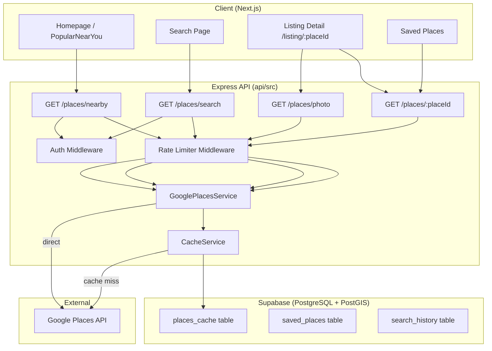
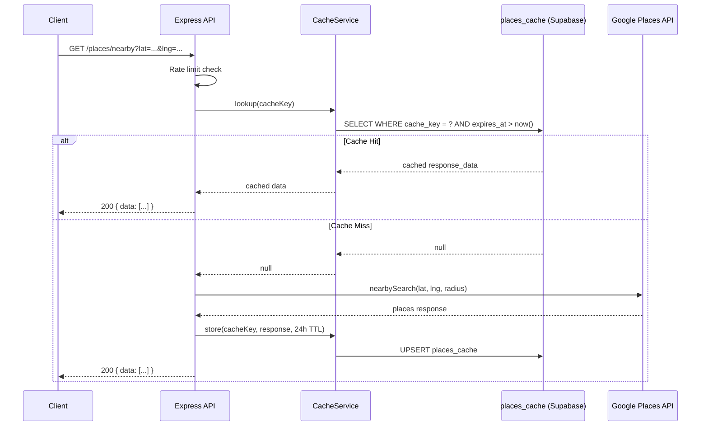

# Design Document: Google Places Integration

## Overview

This design replaces GetNear's internal Supabase-based business listing system with a Google Places API proxy architecture. All place discovery, search, and detail requests flow through the Express backend (`api/src/`), which manages caching, rate limiting, and API key security. The frontend never calls Google directly.

The key architectural shift is from "app owns business data" to "app proxies and caches Google's place data." This removes the need for business dashboards, add-business flows, and internal business CRUD routes while enabling global place discovery.

### Key Design Decisions

| Decision | Rationale |
|----------|-----------|
| Server-side proxy for all Google calls | Protects API key, enables caching, allows rate limiting |
| 24-hour cache TTL in Supabase | Balances data freshness with cost reduction |
| Photo proxy with browser cache headers | Hides API key from image URLs, reduces repeat fetches |
| Place ID as primary reference | Google Place IDs are stable, globally unique identifiers |
| Remove business dashboard entirely | App pivots to discovery-only, no business management |

## Architecture

### System Architecture Diagram



### Request Flow (Cache-First)



## Components and Interfaces

### New Files

| File Path | Purpose |
|-----------|---------|
| `api/src/routes/places.ts` | Express router for all `/places/*` endpoints |
| `api/src/lib/googlePlaces.ts` | Google Places API wrapper service |
| `api/src/lib/placesCache.ts` | Cache read/write logic against `places_cache` table |
| `api/src/middleware/placesRateLimit.ts` | Rate limiters specific to places endpoints |

### Modified Files

| File Path | Change |
|-----------|--------|
| `api/src/routes/index.ts` | Register `/places` router, remove `/dashboard` router |
| `api/src/routes/businesses.ts` | Remove CRUD routes (POST, PUT, DELETE) |
| `apps/web/components/home/PopularNearYou.tsx` | Switch from `/businesses/search` to `/places/nearby` |
| `apps/web/app/listing/[placeId]/page.tsx` | New detail page using Place ID |

### Removed Files

| File Path | Reason |
|-----------|--------|
| `api/src/routes/dashboard.ts` | Business dashboard removed |
| `apps/web/app/dashboard/*` | Business dashboard pages removed |
| `apps/web/app/add-business/*` | Add business flow removed |

---

### GooglePlacesService (`api/src/lib/googlePlaces.ts`)

```typescript
interface GooglePlacesService {
  nearbySearch(params: NearbySearchParams): Promise<NearbySearchResult>
  textSearch(params: TextSearchParams): Promise<TextSearchResult>
  placeDetails(placeId: string, fields: string[]): Promise<PlaceDetailsResult>
  placePhoto(photoReference: string, maxWidth: number): Promise<Buffer>
}

interface NearbySearchParams {
  lat: number
  lng: number
  radius: number          // meters (max 50000)
  type?: string           // e.g., 'restaurant', 'cafe'
  keyword?: string
}

interface TextSearchParams {
  query: string
  lat?: number
  lng?: number
  radius?: number
  type?: string
  openNow?: boolean
  pageToken?: string
}

interface NearbySearchResult {
  places: PlaceSummary[]
  nextPageToken?: string
}

interface TextSearchResult {
  places: PlaceSummary[]
  nextPageToken?: string
}

interface PlaceSummary {
  placeId: string
  name: string
  address: string
  rating?: number
  totalRatings?: number
  photoReference?: string
  businessStatus?: string
  openNow?: boolean
  types?: string[]
  location: { lat: number; lng: number }
}

interface PlaceDetailsResult {
  placeId: string
  name: string
  address: string
  phone?: string
  website?: string
  rating?: number
  totalRatings?: number
  openingHours?: OpeningHours
  reviews?: PlaceReview[]
  photoReferences?: string[]
  businessStatus?: string
  types?: string[]
  location: { lat: number; lng: number }
}

interface PlaceReview {
  authorName: string
  rating: number
  text: string
  relativeTimeDescription: string
}

interface OpeningHours {
  openNow?: boolean
  weekdayText?: string[]
}
```

### CacheService (`api/src/lib/placesCache.ts`)

```typescript
interface CacheService {
  get(cacheKey: string): Promise<CachedEntry | null>
  set(cacheKey: string, placeId: string | null, endpointType: string, data: unknown, ttlSeconds?: number): Promise<void>
  buildKey(endpointType: string, params: Record<string, unknown>): string
  cleanup(): Promise<number>  // returns deleted count
}

interface CachedEntry {
  id: string
  cache_key: string
  place_id: string | null
  response_data: unknown
  endpoint_type: string
  created_at: string
  expires_at: string
}
```

### API Route Definitions

#### `GET /places/nearby`

| Parameter | Type | Required | Default | Description |
|-----------|------|----------|---------|-------------|
| lat | number | yes | — | Latitude |
| lng | number | yes | — | Longitude |
| radius | number | no | 5000 | Radius in meters (max 50000) |
| type | string | no | — | Google place type filter |
| keyword | string | no | — | Keyword filter |

**Response:** `{ data: PlaceSummary[], error: null }`

#### `GET /places/search`

| Parameter | Type | Required | Default | Description |
|-----------|------|----------|---------|-------------|
| q | string | yes | — | Search query text |
| lat | number | no | — | Location bias latitude |
| lng | number | no | — | Location bias longitude |
| radius | number | no | 5000 | Bias radius in meters |
| type | string | no | — | Google place type filter |
| openNow | boolean | no | false | Filter to open places |
| pageToken | string | no | — | Pagination token from previous response |

**Response:** `{ data: PlaceSummary[], meta: { nextPageToken?: string }, error: null }`

#### `GET /places/:placeId`

| Parameter | Type | Required | Description |
|-----------|------|----------|-------------|
| placeId | path | yes | Google Place ID |

**Response:** `{ data: PlaceDetailsResult, error: null }`

#### `GET /places/photo`

| Parameter | Type | Required | Default | Description |
|-----------|------|----------|---------|-------------|
| ref | string | yes | — | Photo reference from Google |
| maxWidth | number | no | 400 | Max image width in px (max 1600) |

**Response:** Binary image data with `Content-Type` and `Cache-Control: public, max-age=86400` headers.

---

## Data Models

### `places_cache` Table (New)

```sql
CREATE TABLE places_cache (
  id UUID PRIMARY KEY DEFAULT gen_random_uuid(),
  cache_key TEXT NOT NULL UNIQUE,
  place_id TEXT,
  endpoint_type TEXT NOT NULL CHECK (endpoint_type IN ('nearby', 'search', 'details', 'photo')),
  response_data JSONB NOT NULL,
  created_at TIMESTAMPTZ NOT NULL DEFAULT now(),
  expires_at TIMESTAMPTZ NOT NULL DEFAULT (now() + INTERVAL '24 hours')
);

CREATE INDEX idx_places_cache_key ON places_cache (cache_key);
CREATE INDEX idx_places_cache_expires ON places_cache (expires_at);
CREATE INDEX idx_places_cache_place_id ON places_cache (place_id);
```

### `saved_places` Table (Modified)

```sql
-- Drop old business_id column, add place_id
ALTER TABLE saved_places DROP COLUMN IF EXISTS business_id;
ALTER TABLE saved_places ADD COLUMN place_id TEXT NOT NULL;

-- Unique constraint: one user cannot save the same place twice
ALTER TABLE saved_places ADD CONSTRAINT uq_saved_places_user_place UNIQUE (user_id, place_id);

-- Final schema:
-- id UUID PRIMARY KEY
-- user_id UUID NOT NULL REFERENCES users(id)
-- place_id TEXT NOT NULL (Google Place ID)
-- collection_id UUID REFERENCES collections(id)
-- created_at TIMESTAMPTZ DEFAULT now()
```

### `search_history` Table (Unchanged)

The existing table schema remains: `id, user_id, query, lat, lng, created_at`. The deduplication logic (no duplicate consecutive queries within 60s) is handled at the application layer before insert.

### Cache Key Strategy

Cache keys are deterministic strings built from endpoint type and sorted parameters:

| Endpoint | Cache Key Pattern | Example |
|----------|-------------------|---------|
| Nearby | `nearby:{lat}:{lng}:{radius}:{type}:{keyword}` | `nearby:12.97:77.59:5000:restaurant:` |
| Search | `search:{query}:{lat}:{lng}:{radius}:{type}:{openNow}:{pageToken}` | `search:pizza:12.97:77.59:5000::false:` |
| Details | `details:{placeId}` | `details:ChIJN1t_tDeuEmsRUsoyG83frY4` |

Coordinates are rounded to 3 decimal places (~111m precision) to increase cache hit rate for nearby users.

---

## Correctness Properties

*A property is a characteristic or behavior that should hold true across all valid executions of a system—essentially, a formal statement about what the system should do. Properties serve as the bridge between human-readable specifications and machine-verifiable correctness guarantees.*

### Property 1: Cache round-trip preserves data

*For any* valid Google Places API response object (of any shape and size), storing it in the places_cache table and retrieving it by the same cache key should produce a JSON-equal object.

**Validates: Requirements 4.1, 4.2**

### Property 2: Cache key determinism and uniqueness

*For any* set of request parameters, generating the cache key is a pure function: the same inputs always produce the same key, and any difference in inputs produces a different key.

**Validates: Requirements 4.1, 4.2**

### Property 3: Coordinate spatial bucketing

*For any* two coordinate pairs where both latitudes round to the same 3-decimal value and both longitudes round to the same 3-decimal value, the generated cache keys should be identical.

**Validates: Requirements 4.2**

### Property 4: Cache TTL correctness

*For any* cached entry with a known `expires_at` timestamp, the cache lookup returns data if and only if the current time is strictly before `expires_at`. An entry at or past its expiry always results in a cache miss.

**Validates: Requirements 4.2, 4.3**

### Property 5: Saved place uniqueness enforcement

*For any* user ID and place ID combination, attempting to save the same place twice should result in exactly one record in the saved_places table, with the second attempt returning a 409 status and "ALREADY_SAVED" error code.

**Validates: Requirements 6.4, 6.5**

### Property 6: Search history deduplication

*For any* authenticated user, query text, and pair of timestamps, if the second timestamp is within 60 seconds of the first and the query text is identical, only one search history entry should exist. If the gap exceeds 60 seconds, both entries should exist.

**Validates: Requirements 7.4**

### Property 7: Rate limit enforcement

*For any* client IP and request sequence of length N within a 1-minute window, if N exceeds the configured maximum (30 for places endpoints), requests N+1 onward within that window should all receive a 429 status code with "Too Many Requests" message.

**Validates: Requirements 5.3, 5.4**

### Property 8: Response transformation completeness

*For any* valid Google Places response (nearby, text search, or details), the transformed output always contains all required fields for that endpoint type. For PlaceSummary: placeId, name, address are always present. For PlaceDetailsResult: placeId, name, address, location are always present. Optional fields are present if and only if the source data contains them.

**Validates: Requirements 1.3, 2.2, 3.1**

### Property 9: Output collection capping

*For any* Google Places response containing N places (where N may be large), the nearby endpoint output contains at most 10 items. For place details with reviews, the output contains at most 5 reviews. The capping never reorders items.

**Validates: Requirements 1.1, 3.2**

### Property 10: Search history ordering and limit

*For any* user with N search history entries (where N may exceed 50), retrieving search history always returns entries sorted by timestamp descending, and the result set contains at most 50 entries.

**Validates: Requirements 7.2**

---

## Error Handling

### Error Response Strategy

All errors follow the existing `{ data: null, error: { code, message } }` envelope pattern using the `sendError` utility.

| Scenario | HTTP Status | Error Code | Message |
|----------|-------------|------------|---------|
| Google API timeout (>5s) | 502 | `UPSTREAM_ERROR` | "Google Places service temporarily unavailable" |
| Google API error response | 502 | `UPSTREAM_ERROR` | "Unable to fetch place data" |
| Invalid Place ID format | 400 | `VALIDATION_ERROR` | "Invalid place ID format" |
| Place not found (Google ZERO_RESULTS) | 404 | `NOT_FOUND` | "Place not found" |
| Invalid photo reference | 404 | `NOT_FOUND` | "Photo not found" |
| Missing required params | 400 | `VALIDATION_ERROR` | Field-specific message |
| Rate limit exceeded | 429 | `RATE_LIMIT_EXCEEDED` | "Too many requests" |
| Duplicate saved place | 409 | `ALREADY_SAVED` | "Place already saved" |
| No API key configured | 500 | `CONFIG_ERROR` | "Service configuration error" |

### Google API Error Handling

The `GooglePlacesService` wraps all Google calls in try/catch with a 5-second timeout using `AbortController`. Specific Google status codes are mapped:

- `OK` → success
- `ZERO_RESULTS` → empty array (not an error for search, 404 for details)
- `OVER_QUERY_LIMIT` → 502 + log alert
- `REQUEST_DENIED` → 500 + log alert (config issue)
- `INVALID_REQUEST` → 400 (pass through validation error)
- Network/timeout → 502

### Retry Strategy

No automatic retries for Google API calls. If Google returns an error or times out, we return 502 immediately. Rationale: retries increase latency for the user and risk amplifying rate limit issues with Google.

---

## Testing Strategy

### Unit Tests (Vitest)

Unit tests verify specific behavior with concrete examples:

- `GooglePlacesService` correctly maps Google response fields to `PlaceSummary` format
- `CacheService.buildKey()` produces expected strings for known inputs
- Coordinate rounding logic truncates correctly
- Error mapping from Google status codes to HTTP responses
- Rate limit middleware configuration values

### Property-Based Tests (fast-check + Vitest)

Property tests verify universal correctness guarantees across randomized inputs. The project already uses `fast-check` (see `api/package.json`).

**Configuration:**
- Minimum 100 iterations per property test
- Each test references its design document property via tag comment
- Tag format: `Feature: google-places-integration, Property {N}: {title}`

**Properties to test:**
1. Cache round-trip (serialize → store → retrieve → deserialize = identity)
2. Cache key determinism (same input → same key; different input → different key)
3. Coordinate spatial bucketing (nearby coords → same cache key)
4. Cache TTL correctness (hit iff not expired)
5. Saved place uniqueness (double save → one record + 409)
6. Search history deduplication (same query within 60s → one record)
7. Rate limit enforcement (over-limit → 429)
8. Response transformation completeness (all required fields present)
9. Output collection capping (nearby ≤ 10 places, details ≤ 5 reviews)
10. Search history ordering and limit (descending timestamp, ≤ 50 entries)

### Integration Tests

- Full request/response cycle through Express routes with mocked Google API
- Cache hit/miss scenarios with real Supabase (test database)
- Photo proxy returns correct content-type and cache headers
- End-to-end saved places CRUD flow

### Test File Organization

```
api/src/__tests__/
  placesCache.test.ts             # Properties 1-4 (cache round-trip, key determinism, spatial bucketing, TTL)
  savedPlacesUniqueness.test.ts   # Property 5 (uniqueness enforcement)
  searchHistoryDedup.test.ts      # Property 6 (deduplication)
  placesRateLimit.test.ts         # Property 7 (rate limiting)
  placesTransform.test.ts         # Properties 8-9 (response shape, output capping)
  searchHistoryOrdering.test.ts   # Property 10 (ordering and limit)
```
