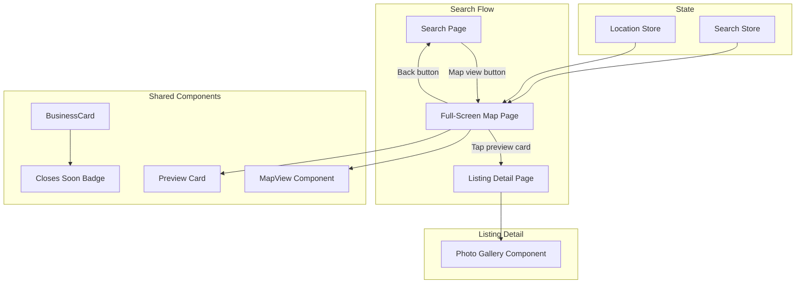
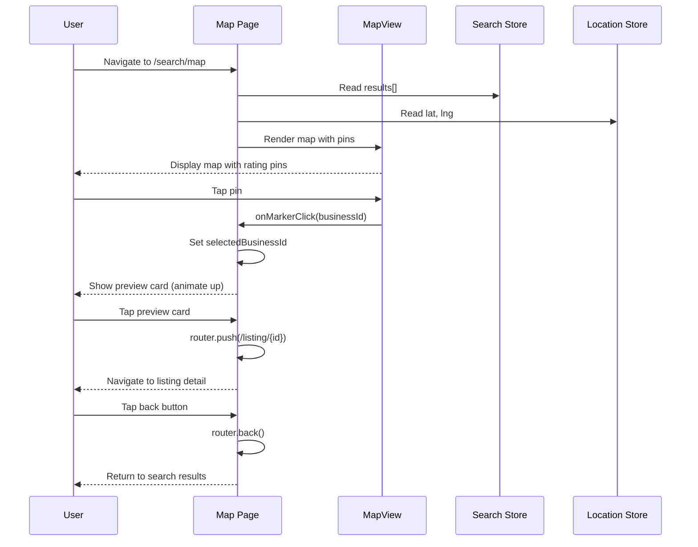
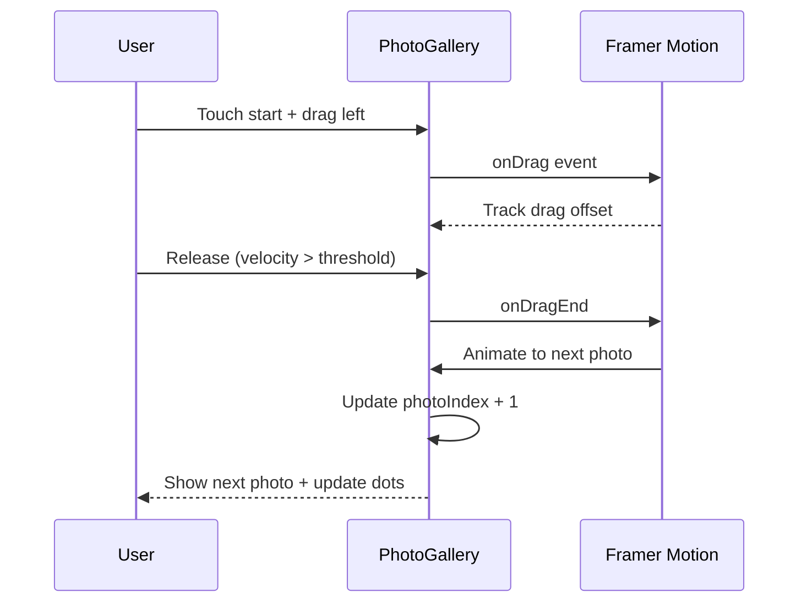

# Design Document: Map, Gallery & Badges UI Enhancements

## Overview

This design covers three UI enhancement features for the GetNear mobile-first web app: (1) a full-screen map view page with interactive business pins and a bottom preview card, (2) a "Closes Soon" orange badge on the BusinessCard component, and (3) a swipeable photo gallery on the listing detail page using framer-motion.

All three features build on existing infrastructure — the `MapView` component, the `getOpenStatus` helper, and framer-motion — requiring no new dependencies. The design prioritizes mobile touch interactions, accessibility, and seamless integration with the existing zustand stores and Next.js App Router patterns.

## Architecture



## Components and Interfaces

### Component 1: Full-Screen Map Page

**Purpose**: Provides an immersive map experience where users can browse businesses spatially, tap pins to preview details, and navigate to full listings.

**Route**: `apps/web/app/(customer)/search/map/page.tsx`

**Interface**:

```typescript
// Internal state for the map page
interface MapPageState {
  selectedBusinessId: string | null
  mapLoaded: boolean
}

// Pin data derived from search results
interface MapPin {
  id: string
  lat: number
  lng: number
  name: string
  rating: number | null
  walkingTime: string
}
```

**Responsibilities**:
- Render a full-screen Google Map using the existing `MapView` component pattern
- Display custom pins showing rating + walking time for each business
- Show a bottom preview card when a pin is tapped
- Navigate to listing detail when the preview card is tapped
- Provide a back button to return to search results list
- Read business data from the search store and location from the location store

### Component 2: Map Preview Card

**Purpose**: A bottom-sheet-style card that appears when a map pin is selected, showing a quick summary of the business.

**Interface**:

```typescript
interface MapPreviewCardProps {
  business: {
    id: string
    name: string
    rating_avg: number | null
    distance_m: number | null
    business_photos: Array<{ url: string; is_primary: boolean }> | null
    business_hours: Array<{
      day: number
      open_time: string | null
      close_time: string | null
      is_closed: boolean
    }> | null
    categories: { name: string } | null
  }
  onTap: () => void
  onClose: () => void
}
```

**Responsibilities**:
- Display business photo, name, rating, distance, open/closed status
- Animate in from bottom when a pin is selected (framer-motion)
- Navigate to listing detail on tap
- Dismiss on swipe down or close button

### Component 3: Closes Soon Badge

**Purpose**: An orange badge displayed on the BusinessCard when a business closes within 1 hour, alerting users to visit soon.

**Interface**:

```typescript
// Helper function signature
function getClosesSoonStatus(
  hours: Array<{
    day: number
    open_time: string | null
    close_time: string | null
    is_closed: boolean
  }> | null | undefined
): boolean

// No new component — integrated into existing BusinessCard
```

**Responsibilities**:
- Calculate if the business closes within 60 minutes
- Render an orange "Closes soon" badge near the existing open/closed badge
- Only show when the business is currently open AND closes within 1 hour

### Component 4: Swipeable Photo Gallery

**Purpose**: Replaces the static single-image display on the listing detail page with a touch-swipeable gallery with dot indicators.

**Interface**:

```typescript
interface PhotoGalleryProps {
  photos: Array<{
    id: string
    url: string
    is_primary: boolean
    display_order: number
  }>
  businessName: string
  className?: string
}
```

**Responsibilities**:
- Display photos in a horizontally swipeable container
- Show dot indicators for current position
- Support touch swipe left/right via framer-motion drag gestures
- Maintain current photo index state
- Provide accessible navigation (ARIA labels, keyboard support)

## Data Models

### Business Data (existing, from search store)

```typescript
// Already defined in @getnear/types - used by search results
interface Business {
  id: string
  name: string
  slug?: string | null
  rating_avg?: number | null
  review_count?: number | null
  address?: string | null
  city?: string | null
  distance_m?: number | null
  lat?: number
  lng?: number
  categories?: { name: string; icon?: string | null; color?: string | null } | null
  business_photos?: Array<{ url: string; is_primary: boolean; display_order?: number }> | null
  business_hours?: Array<{
    day: number
    open_time: string | null
    close_time: string | null
    is_closed: boolean
  }> | null
}
```

### Map Pin Data (derived)

```typescript
interface MapPin {
  id: string
  lat: number
  lng: number
  name: string
  rating: number | null
  walkingTime: string // e.g., "5 min"
}
```

**Validation Rules**:
- `lat` and `lng` must be valid coordinates (lat: -90 to 90, lng: -180 to 180)
- `walkingTime` derived from `distance_m` using 80m/min walking speed
- Pins without valid coordinates are excluded from the map

## Sequence Diagrams

### Full-Screen Map Interaction Flow



### Photo Gallery Swipe Flow



## Key Functions with Formal Specifications

### Function 1: getClosesSoonStatus()

```typescript
function getClosesSoonStatus(
  hours: Array<{
    day: number
    open_time: string | null
    close_time: string | null
    is_closed: boolean
  }> | null | undefined
): boolean
```

**Preconditions:**
- `hours` may be null, undefined, or an empty array (returns false)
- Each hour entry has `day` as 0-6 (Sunday-Saturday)
- `open_time` and `close_time` are in "HH:MM" 24-hour format or null

**Postconditions:**
- Returns `true` if and only if: the business is currently open AND closes within 60 minutes
- Returns `false` if hours data is missing, business is closed, or closes in more than 60 minutes
- No side effects

### Function 2: deriveMapPins()

```typescript
function deriveMapPins(businesses: Business[]): MapPin[]
```

**Preconditions:**
- `businesses` is a valid array (may be empty)
- Each business may or may not have `lat`, `lng`, `distance_m`

**Postconditions:**
- Returns only businesses with valid `lat` and `lng` values
- Each pin includes calculated `walkingTime` from `distance_m` (80m/min)
- Businesses without coordinates are excluded
- Output length ≤ input length

### Function 3: PhotoGallery drag handler

```typescript
function handleDragEnd(
  event: MouseEvent | TouchEvent,
  info: { offset: { x: number }; velocity: { x: number } },
  photoCount: number,
  currentIndex: number
): number // new index
```

**Preconditions:**
- `photoCount` > 0
- `currentIndex` >= 0 and < `photoCount`
- `info.offset.x` and `info.velocity.x` are finite numbers

**Postconditions:**
- Returns new index in range [0, photoCount - 1]
- If swipe left (offset.x < -threshold OR velocity.x < -swipeThreshold): index increments (clamped)
- If swipe right (offset.x > threshold OR velocity.x > swipeThreshold): index decrements (clamped)
- Otherwise: index unchanged (snap back)

**Loop Invariants:** N/A (no loops)

## Example Usage

### Closes Soon Badge Integration

```typescript
// Inside BusinessCard component
const closesSoon = getClosesSoonStatus(business.business_hours)

// In the photo overlay area, after the open/closed badge:
{openStatus === 'open' && closesSoon && (
  <span className="absolute bottom-1.5 right-1.5 px-1.5 py-0.5 rounded text-[9px] font-bold uppercase bg-orange-500 text-white">
    Closes soon
  </span>
)}
```

### Photo Gallery Usage

```typescript
// In listing detail page, replacing the static Image:
<PhotoGallery
  photos={photos}
  businessName={business.name}
  className="h-72 w-full"
/>
```

### Map Page Pin Rendering

```typescript
// In the map page:
const { results } = useSearchStore()
const { lat, lng } = useLocationStore()
const pins = deriveMapPins(results)

<MapView
  markers={pins}
  center={lat && lng ? { lat, lng } : undefined}
  onMarkerClick={(id) => setSelectedBusinessId(id)}
  className="h-full w-full"
/>
```

## Error Handling

### Error Scenario 1: No Location Available

**Condition**: User hasn't granted location permission or location store has null lat/lng
**Response**: Show a centered message prompting location access; disable map rendering
**Recovery**: Re-attempt location on user action

### Error Scenario 2: Google Maps API Fails to Load

**Condition**: Network error or invalid API key prevents Google Maps script from loading
**Response**: Show a fallback placeholder with a "Retry" button
**Recovery**: Re-attempt script loading on retry

### Error Scenario 3: No Photos Available for Gallery

**Condition**: Business has empty `business_photos` array
**Response**: Show a gradient placeholder (matching existing pattern)
**Recovery**: N/A — graceful degradation

### Error Scenario 4: Business Hours Data Missing

**Condition**: `business_hours` is null or empty for "Closes Soon" calculation
**Response**: Don't show the badge (return false from helper)
**Recovery**: N/A — badge simply not displayed

## Testing Strategy

### Unit Testing Approach

- Test `getClosesSoonStatus` with various time scenarios (closing in 30 min, 61 min, exactly 60 min, closed, no data)
- Test `deriveMapPins` with businesses that have/lack coordinates
- Test `handleDragEnd` with various swipe velocities and offsets
- Test boundary conditions (first photo, last photo, single photo)

### Property-Based Testing Approach

**Property Test Library**: fast-check (via vitest)

- Photo gallery index always stays within bounds regardless of swipe input
- `getClosesSoonStatus` returns boolean for any valid hours input
- `deriveMapPins` output is always a subset of input (no fabricated data)
- Walking time calculation is monotonically increasing with distance

### Integration Testing Approach

- Verify map page renders with search store data
- Verify preview card appears on pin selection
- Verify photo gallery responds to swipe gestures
- Verify "Closes Soon" badge appears at correct times

## Correctness Properties

*A property is a characteristic or behavior that should hold true across all valid executions of a system — essentially, a formal statement about what the system should do. Properties serve as the bridge between human-readable specifications and machine-verifiable correctness guarantees.*

### Property 1: Closes Soon threshold correctness

*For any* business_hours array and any mocked current time, `getClosesSoonStatus` returns `true` if and only if the business is currently open (current time is between open_time and close_time for today) AND the closing time is within 60 minutes of the current time. In all other cases (closed, no data, more than 60 minutes until close), it returns `false`.

**Validates: Requirements 1.1, 1.2, 1.3, 1.4, 1.5**

### Property 2: Photo gallery index always stays within bounds

*For any* photoCount > 0, any currentIndex in [0, photoCount-1], and any drag offset/velocity values, the `handleDragEnd` function always returns a new index in the range [0, photoCount - 1].

**Validates: Requirements 2.2, 2.3, 2.4, 2.5**

### Property 3: Dot indicator count equals photo count

*For any* non-empty photos array of length N (where N > 1), the Photo_Gallery renders exactly N dot indicators.

**Validates: Requirement 2.1**

### Property 4: deriveMapPins excludes businesses without valid coordinates

*For any* array of businesses, `deriveMapPins` returns only those businesses that have non-null, finite latitude (in [-90, 90]) and longitude (in [-180, 180]) values.

**Validates: Requirements 3.2, 3.9**

### Property 5: deriveMapPins output is a subset of input

*For any* array of businesses, every item in the `deriveMapPins` output has an `id` that exists in the input array, and the output length is always less than or equal to the input length.

**Validates: Requirement 4.4**

### Property 6: Walking time is monotonically increasing with distance

*For any* two distances d1 and d2 where d1 < d2, the numeric walking time derived from d1 is less than or equal to the walking time derived from d2.

**Validates: Requirements 3.10, 4.2**

## Performance Considerations

- Map page uses the existing lazy-loaded Google Maps script (no duplicate loading)
- Photo gallery uses `next/image` with proper `sizes` attribute for responsive loading
- Preview card animation uses framer-motion's GPU-accelerated transforms
- Map pins are derived once from search results (memoized with `useMemo`)
- Photo gallery only renders the visible photo + adjacent photos for smooth swiping

## Security Considerations

- Google Maps API key is already restricted to the domain via `NEXT_PUBLIC_GOOGLE_MAPS_API_KEY`
- No user input is passed to map URLs without encoding (`encodeURIComponent`)
- Photo URLs come from the trusted API response (Supabase storage)

## Dependencies

- `framer-motion` ^11.2.12 (already installed) — swipe gestures, preview card animation
- `lucide-react` ^0.395.0 (already installed) — icons (ArrowLeft, MapPin, X)
- `zustand` ^4.5.4 (already installed) — search store, location store
- `next/image` (built-in) — optimized photo rendering
- Google Maps JavaScript API (already configured) — map rendering
